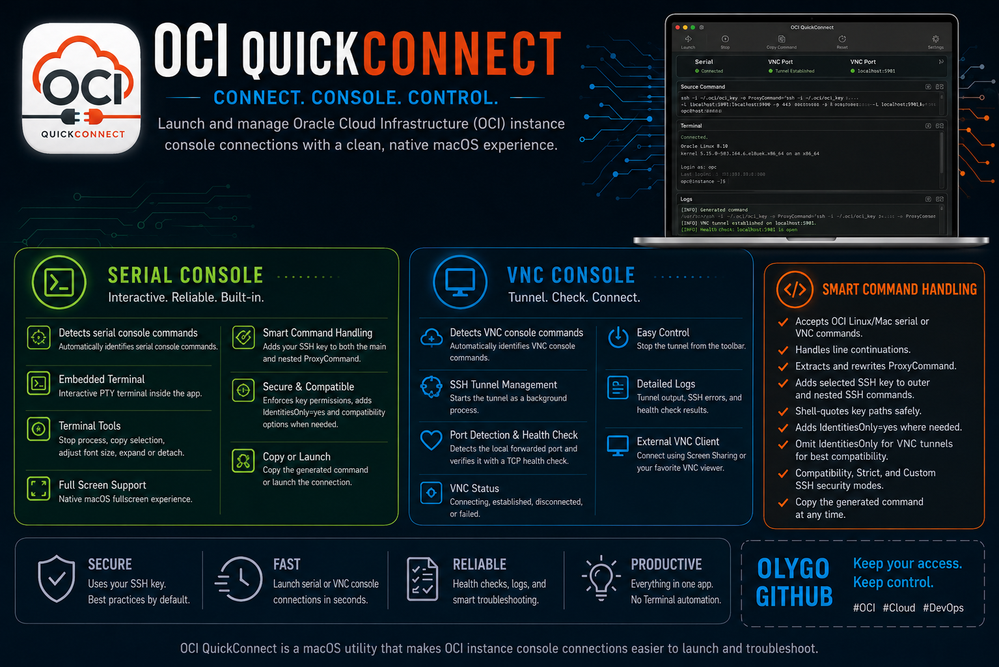

# OCI Console Connections

This repository provides detailed guides on how to use the OCI Console to connect to OCI compute instances using **Local Connection**. Whether you're working with Linux or Windows instances, you'll find step-by-step instructions tailored for users on Windows, macOS, and Linux.

### What You'll Learn :

- [How the OCI Console connection mechanism works](./console-connection-overview.md)

- [Enabling Windows SAC](./enable-windows-sac.md)

- [Serial Console Connection from Windows to Linux or Windows](./serial-windows-to-linux-or-windows.md)

- [Serial Console Connection from Linux or MacOS to Linux or Windows](./serial-linux-macos-to-linux-or-windows.md)

- [VNC Console Connection from Linux or MacOS to Linux or Windows](./vnc-linux-macos-to-linux-or-windows.md)

- [VNC Console Connection from Windows to Linux or Windows](./vnc-windows-to-linux-or-windows.md)

## OCI QuickConnect for macOS

[OCI QuickConnect](https://github.com/Olygo/OCI_QuickConnect) is a macOS utility that makes OCI instance console connections easier to launch and troubleshoot.

## Contact

[github@olygo.com](mailto:github@olygo.com)