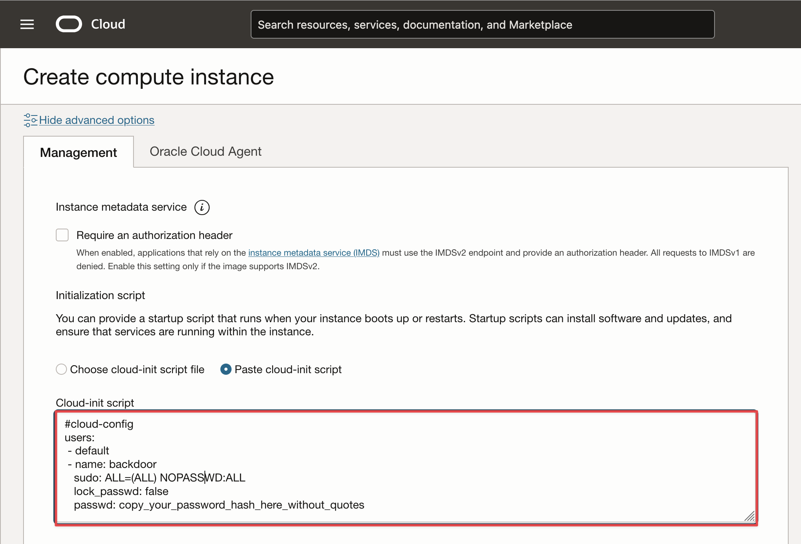

# Enable Linux User Password

OCI creates Linux user accounts that authenticate using SSH key pairs instead of passwords; however when connecting to a Linux instance via a console connection, you will be prompted to enter a username and password.

---

## 1. Create a recovery account with a password

For instances where you still have access, you can create a recovery account. 

```bash
sudo useradd -m -s /bin/bash recovery
sudo passwd recovery
sudo usermod -aG sudo recovery
```

By default, this user will not be able to connect via SSH without an SSH key, as SSH access is denied. Additionally, you can explicitly block SSH access for this user by adding the line `DenyUsers recovery` to the `/etc/ssh/sshd_config` file and then reloading the SSH service with:

```bash
sudo systemctl reload sshd
```

## 2. Create a recovery account at instance launch

You can create a `recovery` account with a password at instance launch using a Cloud-init script

- [Generate a Linux password hash ](./generate_linux_password_hash.sh)

-  Copy the password hash in the [Cloud-init script](./linux_cloud_init.sh)

Linux Cloud-init script :

```bash
#cloud-config
users:
 - default
 - name: backdoor
   sudo: ALL=(ALL) NOPASSWD:ALL
   lock_passwd: false
   passwd: copy_your_password_hash_here_without_quotes
```



## 3. Credits

Thanks to my colleague Richard for sharing [OCI-Cloudinit-Backdoors](https://github.com/AnykeyNL/OCI-Cloudinit-Backdoors)
