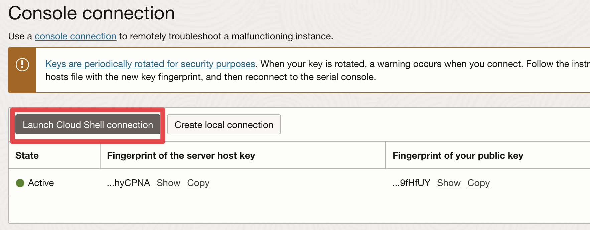
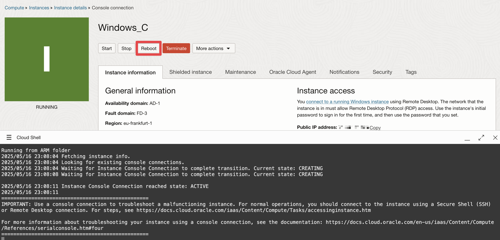
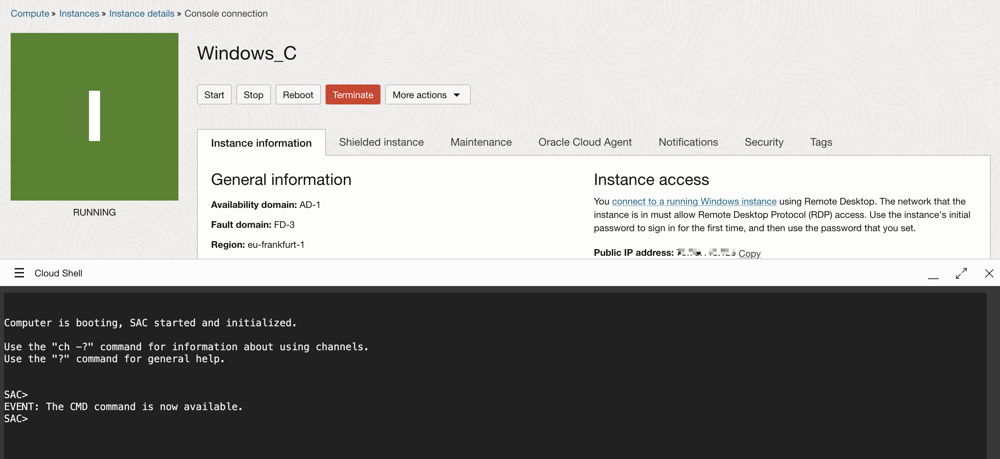

# Enabling Windows Shell Access for OCI Console Connection

This guide describes how to enable the Special Administration Console (SAC) on a Windows Server instance in order to access the Windows command line through OCI Console Connection. This setup is especially useful when using **CloudShell** or the **OCI serial console** to troubleshoot Windows instances.

## Prerequisites

- An OCI Windows instance
- Administrative access to the instance

---

## Step-by-Step Guide

### 1. Enable SAC
Open **PowerShell as Administrator** and run the following commands:

```powershell
bcdedit /ems "{current}" on
bcdedit /emssettings EMSPORT:1 EMSBAUDRATE:115200
```

### 2. Enable the Boot Menu for EMS

Still in the PowerShell session, run:

```powershell
bcdedit /set "{bootmgr}" displaybootmenu yes
bcdedit /set "{bootmgr}" timeout 15
bcdedit /set "{bootmgr}" bootems yes
```

### 3. Launch Cloud Shell Console Connection



### 4. Reboot the instance from the OCI console



### 5. Check SAC is enabled

After the instance reboot, you should see the SAC prompt:



```
Computer is booting, SAC started and initialized.

Use the "ch -?" command for information about using channels.
Use the "?" command for general help.

SAC>
```

---

## Useful SAC Commands

#### Show Help:
```text
SAC> help
```

#### Create a New CMD Channel:
```text
SAC> cmd
```

Expected output:
```
EVENT:   A new channel has been created.  Use "ch -?" for channel help.
Channel: Cmd0001
```

#### Switch to the CMD Channel:
```text
SAC> ch -sn Cmd0001
```

Use `<Esc><Tab>` to cycle channels or `<Esc><Tab>0` to return to SAC.

---

## Authenticate to Windows

Once the CMD prompt is available, you'll be asked for credentials:

```
Username: opc
Domain  : 
Password: ************
```

```
SAC>                                                                            
Microsoft Windows [Version 10.0.20348.3453]
(c) Microsoft Corporation. All rights reserved.

C:\Windows\system32>
```

---

## Reference

- [Enable Serial Console functionality for Windows Servers](https://learn.microsoft.com/en-us/troubleshoot/azure/virtual-machines/windows/serial-console-windows#enable-serial-console-functionality-for-windows-server)
