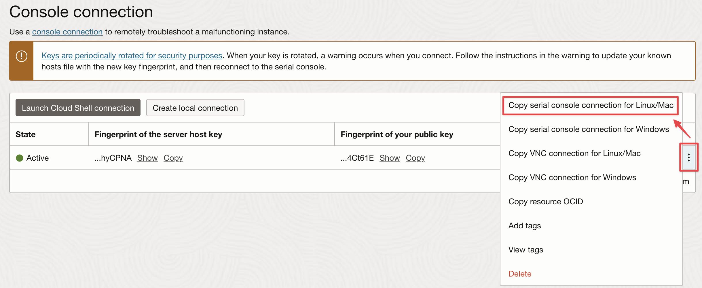

# Serial Console Connection from Windows with Git Bash to Linux or Windows 

This guide explains how to establish a **serial console connection** to an OCI instance (Windows or Linux) using SSH from a Windows terminal.

---

## 1. Prerequisites

### To connect to Windows instances
To access a Windows shell via an OCI Console Connection, Windows SAC must be enabled beforehand.

See [Enable Windows SAC](./enable-windows-sac.md)

### To connect to Linux instances
OCI creates Linux user accounts that authenticate using SSH key pairs instead of passwords; however when connecting to a Linux instance via a console connection, you will be prompted to enter a username and password.

See [Enable Linux user password](./enable-linux-user-password.md)

### Install Git Bash for Windows  
Git Bash provides a Unix-like shell with SSH capabilities on Windows.
It must be installed ***on the Windows machine from which you will connect to the OCI Console Connection***

Download from:  
[https://git-scm.com/downloads/win](https://git-scm.com/downloads/win)

---

## 2. Create an OCI Console Connection

- Go to the OCI Console
- Navigate to your instance
- Click on **Console Connections** and then **Create Local Connection**
- Let **OCI generate the SSH key pair**.
- Download the `private_key` file and save it locally (e.g., on your Desktop as `private.key`).

---

## 3. Copy the SSH Command

Once the console connection has been created, click on the 3 dots on the right and click  **"Copy serial console connection for Linux/Mac"** to get the SSH command.



---

## 4. Prepare the Private Key

Launch **Git Bash** and run:

```bash
chmod 600 /c/Users/opc/Desktop/private.key
```

Ensure the path matches where you saved the key.

---

## 5. Update the SSH command and connect

From **Git Bash** 

Add the following arguments to the SSH command:

```bash
-i ~/Desktop/private.key	
-o HostKeyAlgorithms=+ssh-rsa
-o PubkeyAcceptedKeyTypes=+ssh-rsa
```
Here is what your command should look like:

```bash
ssh -i ~/Desktop/private.key  \
-o HostKeyAlgorithms=+ssh-rsa  \
-o PubkeyAcceptedKeyTypes=+ssh-rsa  \
-o ProxyCommand='ssh -i ~/Desktop/private.key \
-W %h:%p \
-p 443 ocid1.instanceconsoleconnection.oc1.eu-frankfurt-1.XXXXXX@instance-console.eu-frankfurt-1.oci.oraclecloud.com'  \
ocid1.instance.oc1.eu-frankfurt-1.XXXXXX
```

Ensure the path matches where you saved the key.

> The `ProxyCommand` tunnels the SSH connection to the instance console via OCI’s console endpoint.

- When prompted, type `yes` to accept the SSH fingerprint.
- Press `Enter` twice, to start the shell

---

## 6. SAC (Special Administration Console) Access

You will be dropped into the Windows **SAC (Serial Console)** interface:

```text
SAC> cmd
EVENT:   A new channel has been created.  Use "ch -?" for channel help.
Channel: Cmd0001

SAC> ch -sn Cmd0001
Name:                  SAC
Description:           Special Adminis
Type:                  VT-UTF8
Channel GUID:          a38be9b2-29ed-11f0-b637-xxxxx
Application Type GUID: 63d02270-8aa4-11d5-bccf-xxxxx
```

### Switch Channels:

- Press `<Esc><Tab>` to cycle channels.
- Press `<Esc><Tab>0` to return to the main SAC channel.

---

## 7. Login Prompt

You'll be prompted to enter credentials:

```text
Please enter login credentials.
Username: opc
Domain  : 
Password: ************
```

Once authenticated, you'll access the Windows command prompt:

```text
C:\Windows\system32>
```

You now have emergency access to the instance for recovery and troubleshooting.

## 8. Why the SSH Options Are Needed

Starting with **OpenSSH 8.8** (2021), the `ssh-rsa` algorithm is **disabled by default** due to its cryptographic weaknesses (SHA-1). However, some OCI's instance console connections may still rely on it.

The options `-o HostKeyAlgorithms=+ssh-rsa` and `-o PubkeyAcceptedKeyTypes=+ssh-rsa` are used to enable support for deprecated RSA algorithms in OpenSSH clients:

### `-o HostKeyAlgorithms=+ssh-rsa`

- Adds `ssh-rsa` to the list of accepted host key algorithms.
- Necessary when the SSH server only supports `ssh-rsa`, which is based on **SHA-1** (now deprecated).
- Ensures the client can authenticate the **server** identity.

### `-o PubkeyAcceptedKeyTypes=+ssh-rsa`

- Enables the use of RSA keys for **user authentication**.
- Needed if your private key is of type `ssh-rsa` and the server doesn't support newer key types.

