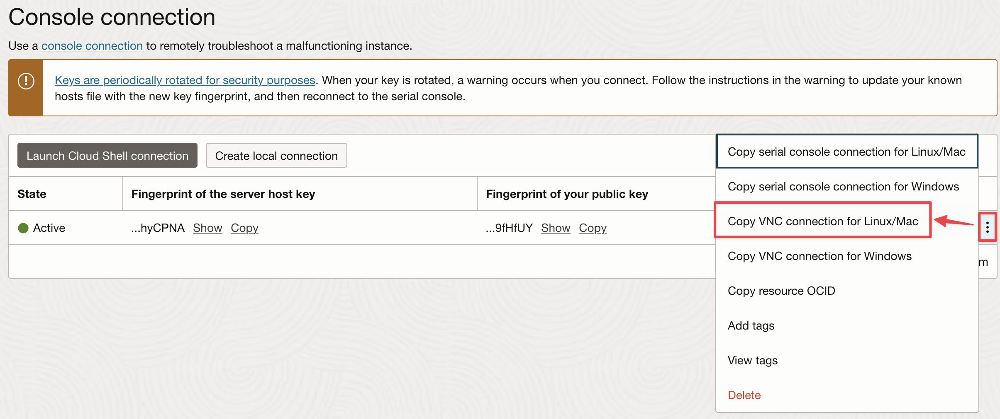

# VNC Console Connection from Linux or MacOS to Linux or Windows

This guide explains how to establish a **VNC console connection** to an OCI instance (Windows or Linux) using SSH and VNC from a Linux or macOS.

---

## 1. Prerequisites

### Install a VNC Viewer
Download and install a **VNC Viewer** like:  
[https://github.com/TigerVNC/tigervnc/releases](https://github.com/TigerVNC/tigervnc/releases)

### To connect to Linux instances
OCI creates Linux user accounts that authenticate using SSH key pairs instead of passwords; however when connecting to a Linux instance via a console connection, you will be prompted to enter a username and password.

See [Enable Linux user password](./enable-linux-user-password.md)

## 2. Create an OCI Console Connection

- Go to the OCI Console
- Navigate to your instance
- Click on **Console Connections** and then **Create Local Connection**
- Let **OCI generate the SSH key pair**.
- Download the `private_key` file and save it locally (e.g., on your Desktop as `private.key`).

---

## 3. Copy the SSH Command

Once the console connection has been created, click on the 3 dots on the right and click  **"Copy VNC connection for Linux/Mac"** to get the SSH command.



---

## 4. Prepare the SSH Private Key

After downloading the `private.key` file:

```bash
chmod 600 /Users/john/Desktop/private.key
```

- Ensure the path matches where you saved the key.

---

## 5. Update the SSH command and connect
	
Add the following arguments to the SSH command:

```bash
-i /Users/john/Desktop/private.key	
-o HostKeyAlgorithms=+ssh-rsa
-o PubkeyAcceptedKeyTypes=+ssh-rsa
```

Here is what your command should look like:

```bash
ssh -i /Users/john/Desktop/private.key \
-o HostKeyAlgorithms=+ssh-rsa \
-o PubkeyAcceptedKeyTypes=+ssh-rsa \
-o ProxyCommand='ssh -i /Users/john/Desktop/private.key \
-W %h:%p \
-p 443 ocid1.instanceconsoleconnection.oc1.eu-frankfurt-1.xxxxx@instance-console.eu-frankfurt-1.oci.oraclecloud.com' \
-N \
-L localhost:5900:ocid1.instance.oc1.eu-frankfurt-1.yyyyy:5900 ocid1.instance.oc1.eu-frankfurt-1.yyyyy
```

- Ensure the path matches where you saved the key.


> This command sets up a secure SSH tunnel between port `5900` on your local machine and the instance VNC server.

- When prompted, type `yes` to accept the SSH fingerprint.
- Press `Enter` twice, to start the shell

---

## 6. Connect with VNC Viewer

Launch **VNC Viewer** and connect to:

```
127.0.0.1:5900
```

This forwards your VNC session to the instance through the secure tunnel.

---

## 7. Why the SSH Options Are Needed

Starting with **OpenSSH 8.8** (2021), the `ssh-rsa` algorithm is **disabled by default** due to its cryptographic weaknesses (SHA-1). However, some OCI's instance console connections may still rely on it.

The options `-o HostKeyAlgorithms=+ssh-rsa` and `-o PubkeyAcceptedKeyTypes=+ssh-rsa` are used to enable support for deprecated RSA algorithms in OpenSSH clients:

### `-o HostKeyAlgorithms=+ssh-rsa`

- Adds `ssh-rsa` to the list of accepted host key algorithms.
- Necessary when the SSH server only supports `ssh-rsa`, which is based on **SHA-1** (now deprecated).
- Ensures the client can authenticate the **server** identity.

### `-o PubkeyAcceptedKeyTypes=+ssh-rsa`

- Enables the use of RSA keys for **user authentication**.
- Needed if your private key is of type `ssh-rsa` and the server doesn't support newer key types.